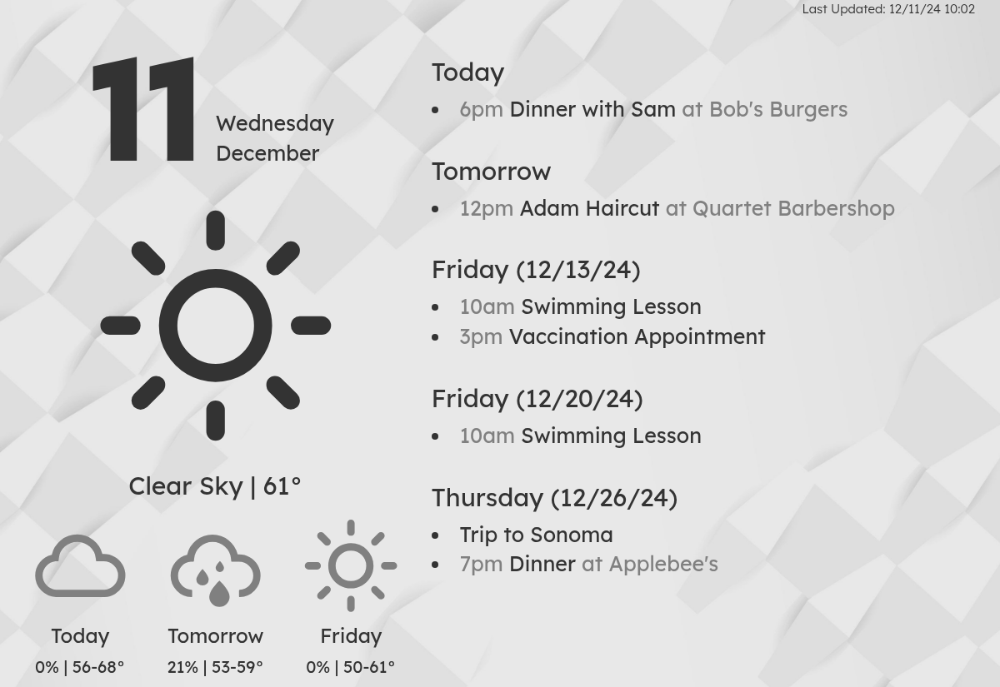

# Family E-Ink Dashboard

This project contains code to build a battery-powered E-Ink dashboard for the entire family based on an Inkplate 10. It shows weather from OpenWeatherMap and a calendar feed which are rendered in a Docker container that runs somewhere in your home network. It started as a fork of the great [MagInkDash](https://github.com/speedyg0nz/MagInkDash) but the codebase has changed quite a bit since then.



## Background

I liked the premise of [MagInkDash](https://github.com/speedyg0nz/MagInkDash) but I'd rather have a containerized backend doing the rendering since that's easier to setup in my Docker-based homelab. Additionally, I'd like to enable the use of non-Google calendars, remove the ChatGPT and Telegram integrations, show more data on the display, and render the data in real-time.

## Hardware Required

* **Docker host machine** (`linux/amd64` and `linux/arm64` are supported): Used as a server to retrieve content and generate a dashboard for the E-Ink display. Just needs to have [Docker](https://docs.docker.com/get-started/get-docker/) and [Docker Compose](https://docs.docker.com/compose/) installed so any old machine or SBC would do. I would recommend not having this container exposed to the public Internet since it does not use authentication.

* **[Inkplate 10 Battery Powered E-Ink Display](https://soldered.com/product/soldered-inkplate-10-9-7-e-paper-board-with-enclosure-copy/)**: Used as a client to display the generated dashboard. I went with this because it was an all-in-one with the enclosure and battery included so there's less hardware tinkering.

## How It Works

On the backend, a Python API based on Docker and FastAPI is serving the image with all the desired info. As soon as the Inkplate requests the image, it pulls the calendar data and a weather forecast from OpenWeatherMap. The retrieved content is then formatted into the desired layout and served as a PNG image file.

On the Inkplate 10, a script will then connect to the server on the local network via a WiFi connection, retrieve the image and display it on the E-Ink screen. The Inkplate 10 then goes to sleep to conserve battery for 60 minutes or until the wake button is pressed.

Some features of the dashboard:

* **Battery Life**: As with similar battery powered devices, the biggest question is the battery life. With the 3000mAh that comes with the manufacturer assembled Inkplate 10, we could potentially be looking at 6-8 month battery life. With this crazy battery life, there are much more options available. Perhaps solar power for unlimited battery life? Or reducing the refresh interval to 15 or 30min to increase the information timeliness?

* **Calendar and Weather**: I'm currently displaying calendar events and weather forecast for current day and the upcoming two days. No real reason other than the desire to know what my weekend looks like on a Friday, and therefore helping me to better plan my weekend. Unfortunately, if you have a busy calendar with numerous events on a single day, the space on the dashboard will be consumed very quickly. If so, you might wish to modify the code to reduce/limit the number of days/events to be displayed.

## Installation

1. On the server host, make sure that `docker` and `docker compose` are installed.

2. Download the `docker-compose.yml` file from this repo and adjust the environment variables, see the section **Config Reference** below. If you are not sure how to get the ICS URL, refer to **How to get the ICS URL** below. You will also need to sign up for a [OpenWeather One Call API 3.0 key](https://openweathermap.org/api/one-call-3) which needs an account but is free for 1000 calls/day.

3. Start up the server with `docker compose up -d`. You can check the logs with `docker compose logs -f` and ensure that there are no errors.

4. Using the DNS name or IP of your host machine, you can go to  <http://IP_ADDRESS:5000/docs> to see whether the API is running.

5. As for the Inkplate, I'm not going to devote too much space here since there are [official resources that describe how to set it up](https://inkplate.readthedocs.io/en/latest/get-started.html). It may take some trial and error for those new to microcontroller programming but it's all worth it! Only the Arduino portion of the guide is relevant, and you'll need to be able to run *.ino scripts via Arduino IDE before proceeding. From there, run the `inkplate10.ino` file from the `inkplate10` folder from the Arduino IDE when connected to the Inkplate.

6. That's all! Your family calendar dashboard should now be refreshed every hour!

## How to get the ICS URL

The dashboard supports any standard ICS feed, here are a few popular calendars and how you can get the ICS feed URL. These instructions might change and are up-to-date as of December 2024.

### Google Calendar

Go to the calendar you want to display, click `Settings and sharing`, and copy the `Secret address in iCal format`.

### Proton Calendar

Go to the calendar you want to display, click `Share`, then `Share with anyone`, then `Full view (see all event details)`, click `Create`, and copy the link.

### Nextcloud

Go to the calendar you want to display, click the edit icon, create a share link, and `Copy subscription link`.

## Config Reference

These are the config variables you can configure in the `environment` section of the Docker Compose file:

Variable | Required | Default | Description
--- | --- | --- | ---
ICS_URL | Yes | | URL(s) of the ICS calendar feeds (multiple calendars separated by "\|")
LAT | Yes | | Latitude in decimal for the weather forecast location
LNG | Yes | | Longitude in decimal for the weather forecast location
OWM_API_KEY | Yes | | [OpenWeatherMap API key](https://openweathermap.org/api/one-call-3) to retrieve weather forecast
DISPLAY_TZ | No | America/Los_Angeles | Time zone for displaying the calendar
IMAGE_HEIGHT | No | 825 | Height of image to be generated for display
IMAGE_WIDTH | No | 1200 | Width of image to be generated for display
NUM_CAL_DAYS_TO_QUERY | No | 30 | Number of days to query from the calendar
SHOW_ADDITIONAL_WEATHER | No | False | Whether to show "Feels Like" temperature and UV index for the next hour
SHOW_CALENDAR_NAME | No | False | Show the calendar name on the event line (useful for multiple calendars)
SHOW_MOON_PHASE | No | False | Whether to show the current moon phase next to the date
USE_24H_FORMAT | No | True | Whether to display time in 24‑hour format (otherwise 12‑hour AM/PM)
WEATHER_UNITS | No | metric | Units of measurement for the temperature, `metric` and `imperial` units are available

## Development

This project uses Poetry for package management and Ruff for linting and formatting.

Run

```shell
poetry run python src/main.py
```

or

```shell
docker compose -f docker-compose.dev.yml up --build
```

locally to start the application, API docs will be served at <http://localhost:5000/docs>.

### Testing

```shell
# Run all tests
poetry run pytest

# Run tests with verbose output
poetry run pytest -v

# Run tests with coverage report
poetry run pytest --cov=src --cov-report=term-missing
```

### Linting & Formatting

```shell
poetry run ruff check --fix
poetry run ruff format
```

## Acknowledgements

- [MagInkDash](https://github.com/speedyg0nz/MagInkDash): Starting point for this project
- [Lexend Font](https://fonts.google.com/specimen/Lexend) and [Tilt Warp Font](https://fonts.google.com/specimen/Tilt+Warp): Fonts used for the dashboard display
- [Bootstrap](https://getbootstrap.com/): Styling toolkit to customize the look of the dashboard
- [Weather Icons](https://erikflowers.github.io/weather-icons/): Icons used for displaying of weather forecast information
- [Freepik](https://www.freepik.com/): For the background image used in this dashboard

## Contributing

Feel free to fork the repo and modify it for your own purpose or create an issue and I see whether I can help.
